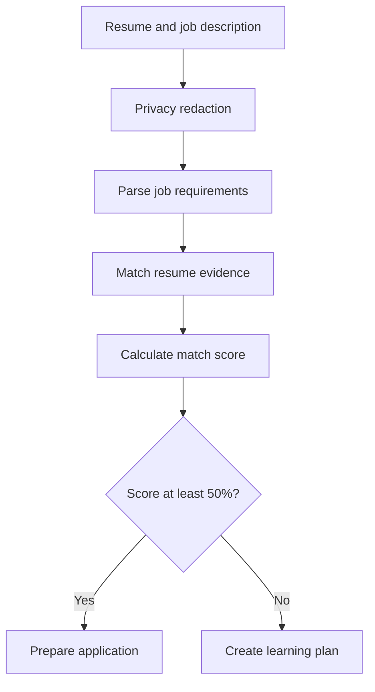

# CareerLens AI

CareerLens AI is an agentic resume and job-analysis assistant that compares verified resume evidence with a job description, calculates a transparent match score, and automatically chooses the appropriate next action.

## Live Demo

[Launch CareerLens AI](https://careerlens-ai-lkxgjanfs6r2wbv4fphesh.streamlit.app/)

- Suitable match: prepares application materials

- Lower match: creates a targeted learning plan

## Features

- Extracts text from PDF resumes

- Removes email addresses, phone numbers and URLs

- Converts job descriptions into structured requirements

- Matches skills using verified resume evidence

- Calculates a transparent deterministic score

- Uses LangGraph for conditional agent routing

- Generates an application email and cover letter

- Generates a targeted learning plan for lower matches

- Provides downloadable application materials

- Handles Gemini quota and availability errors

- Includes automated privacy, scoring, routing and generation tests

## Agent Workflow



## Technology Stack

- Python

- Streamlit

- LangChain

- LangGraph

- Google Gemini API

- Pydantic

- PyPDF

- Pytest

- Git and GitHub

## Scoring System

CareerLens evaluates:

- Required skills: 70%

- Preferred skills: 10%

- Education: 10%

- Experience: 10%

Only components specified by the job description are included in the final weighted score.

## Privacy

CareerLens removes the following information before resume matching:

- Email addresses

- Phone numbers

- URLs

The user must provide consent before analysis begins.

The remaining resume content—including name, city, education, skills, projects and experience—may be sent to Gemini.

## Installation

Clone the repository:

```bash

git clone https://github.com/reddysaicharan985/careerlens-ai.git

cd careerlens-ai

```

Create and activate a virtual environment:

```bash

python -m venv .venv

```

Windows:

```powershell

.\.venv\Scripts\Activate.ps1

```

Install dependencies:

```bash

python -m pip install -r requirements.txt

```

Create a `.env` file:

```env

GOOGLE_API_KEY=your_google_gemini_api_key

```

Never commit the `.env` file or expose the API key publicly.

## Run the Application

```bash

streamlit run app.py

```

## Run Automated Tests

```bash

python -m pytest -v

```

Current result:

```text

10 passed

```

The automated tests do not call Gemini and therefore do not consume API quota.

## Project Structure

```text

careerlens-ai/

├── app.py

├── agent.py

├── config.py

├── requirements.txt

├── services/

│   ├── action_generator.py

│   ├── action_schema.py

│   ├── gemini_service.py

│   ├── job_parser.py

│   ├── job_schema.py

│   ├── match_schema.py

│   ├── privacy.py

│   ├── resume_matcher.py

│   └── scoring.py

├── tools/

│   └── resume_tool.py

└── tests/

    ├── test_action_generator.py

    ├── test_agent_routing.py

    ├── test_privacy.py

    └── test_scoring.py

```

## Important Limitations

- CareerLens provides decision support, not a hiring guarantee.

- Generated application materials must be reviewed before use.

- Match quality depends on the resume and job-description details.

- Free Gemini API usage is subject to rate limits.

- The application currently accepts PDF resumes only.

## Developer

**Mukkara Sai Charan Reddy**

B.Tech CSE–AIML student focused on AI engineering, RAG systems, agentic workflows and practical AI applications.

[LinkedIn](https://www.linkedin.com/in/sai-charan-reddy-mukkara)


